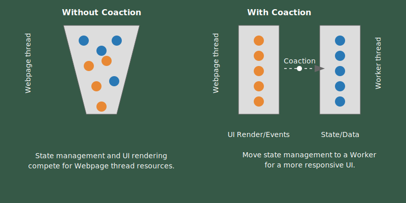
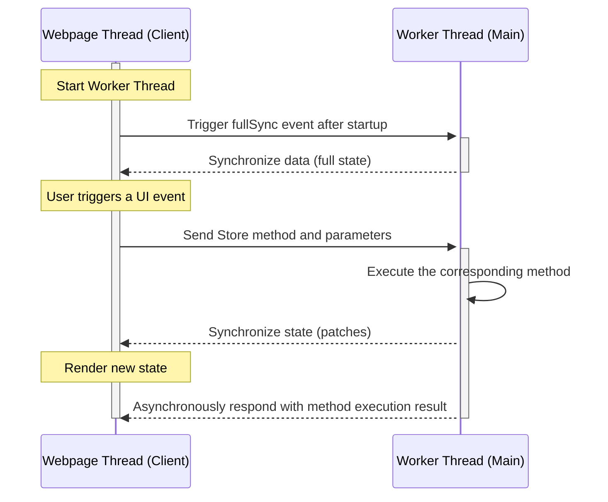

# coaction

A sleek and flexible JavaScript library designed for building high-performance, multithreading web applications.

## Motivation

Modern web applications are becoming increasingly complex, pushing the boundaries of what's possible in the browser. Single-threaded JavaScript, while powerful, often struggles to keep up with the demands of sophisticated UIs, real-time interactions, and data-intensive computations. This bottleneck leads to performance issues, laggy or unresponsive interfaces, limitations in request connections, and ultimately, a compromised user experience.

While Web Workers offer a path towards parallelism and improved performance, they introduce a new set of challenges. Managing state across threads, synchronizing data efficiently, and maintaining coherent application logic can quickly become a daunting task. Existing state management solutions often fall short in addressing these specific needs, either by being too tightly coupled to the worker thread or by introducing complex abstractions that hinder developer productivity.



**`Coaction` was created out of the need for a state management solution that truly embraces the multithreading nature of modern web applications.** It recognizes that performance and developer experience shouldn't be mutually exclusive. By leveraging the power of Web Workers and Shared Workers, `Coaction` allows developers to offload computationally intensive tasks and state management logic from the worker thread, resulting in a more responsive and fluid user interface.

**More than just performance, `Coaction` is about enabling a more scalable and maintainable architecture for complex applications.** The library's intuitive API, inspired by popular state management solutions, ensures a smooth learning curve and a productive development workflow. Its support for Slices, namespaces, and computed properties promotes modularity and code organization, making it easier to manage large and evolving codebases.

**`Coaction`'s integration with `data-transport` unlocks a new level of flexibility in state synchronization.** By supporting generic transport protocols, it opens up possibilities for various communication patterns and architectures, catering to the unique needs of different applications.

**In essence, `Coaction` empowers developers to build the next generation of web applications without sacrificing performance, developer experience, or architectural integrity.** It bridges the gap between the increasing complexity of web applications and the need for efficient, maintainable, and performant state management across threads. It's a tool designed for developers who strive to create exceptional user experiences in a world where parallelism and responsiveness are no longer optional, but essential. It also supports remote synchronization, making it suitable for building any CRDTs application as well.

## Concepts and Features

`Coaction` aims to provide a secure and efficient solution for sharing and synchronizing state in multithreading environments (such as Web Workers, Shared Workers, or even across processes and devices) in web applications.

Key features include:

- **Multithreading Sync**: Supports sharing state between webpage thread and the worker thread. With `data-transport` for generic communication, developers can avoid the complexities of message passing and serialization logic.
- **Immutable State with Optional Mutability**: Powered by the [Mutative](https://github.com/unadlib/mutative) library, the core provides an immutable state transition process while allowing performance optimization with mutable instances when needed.
- **Patch-Based Updates**: Enables efficient incremental state changes through patch-based synchronization, simplifying its use in CRDTs applications.
- **Built-in Computed Data**: Supports derived properties based on state dependencies, making it easier to manage and retrieve computed data from core states.
- **Slices Pattern**: Easily combine multiple slices into a store.
- **Extensible Middleware**: Allows for middleware to enhance the store’s behavior, such as logging, time-travel debugging, or integration with third-party tools.
- **Integration with 3rd-Party Libraries**: Supports popular frameworks like React, Angular, Vue, Svelte, and Solid, as well as state management libraries such as Redux, Zustand, and MobX.

## Operating Modes and Fundamentals

This library operates in two primary modes:

- Standard Mode
  - In a standard webpage environment, the store is managed entirely within the webpage thread.
- Shared Mode
  - The worker thread serves as the primary source of the shared state, utilizing transport for synchronization.
  - Webpage thread act as clients, accessing and manipulating the state asynchronously through a store.

In shared mode, the library automatically determines the execution context based on the transport parameters, handling the synchronization thread seamlessly.

### Shared Mode - Sequence Diagram



## Performance

TBD

## Installation

You can install the library for React application via npm, yarn, or pnpm.

```bash
npm install @coaction/react
# or
yarn add @coaction/react
# or
pnpm add @coaction/react
```

If you want to use the core library without any framework, you can install it via npm, yarn, or pnpm.

```bash
npm install coaction
# or
yarn add coaction
# or
pnpm add coaction
```

## Usage

### Standard Mode Store

```jsx
import { create } from '@coaction/react';

const useStore = create((set, get) => ({
  count: 0,
  increment: () => set((state) => state.count++)
}));

const CounterComponent = () => {
  const store = useStore();
  return (
    <div>
      <p>Count: {store.count}</p>
      <button onClick={store.increment}>Increment</button>
    </div>
  );
};
```

### Shared Mode Store

`counter.js`:

```js
import { create } from '@coaction/react';

export const counter = (set) => ({
  count: 0,
  increment: () => set((state) => state.count++)
});
```

`worker.js`:

```js
import { create } from '@coaction/react';
import { counter } from './counter';

const useStore = create(counter);
```

```jsx
import { create } from 'coaction';

const worker = new Worker(new URL('./worker.js', import.meta.url));
const useStore = create(counter, { worker });

const CounterComponent = () => {
  const store = useStore();
  return (
    <div>
      <p>Count in Worker: {store.count}</p>
      <button onClick={store.increment}>Increment</button>
    </div>
  );
};
```

### Slices Pattern And Derived Data

```jsx
import { create } from '@coaction/react';

const counter = (set) => ({
  count: 0,
  // derived data
  doubleCount: get(
    (state) => [state.counter.count],
    (count) => count * 2
  ),
  increment() {
    set(() => {
      // you can use `this` to access the slice state
      this.count += 1;
    });
  }
});

const useStore = create({
  counter
});
```

## Integration

Coaction is designed to be compatible with a wide range of libraries and frameworks.

### Supported Libraries and Frameworks

- [x] React
- [ ] Vue
- [ ] Angular
- [ ] Svelte
- [ ] Solid

### State Management Libraries

- [x] MobX
- [x] Pinia
- [ ] Zustand
- [ ] Redux Toolkit
- [ ] Jotai
- [ ] XState
- [ ] Valtio

## Difference between Coaction and Zustand

- support getter accessor
- support computed properties for derived data
- support namespace slice
- support auto selector for getter state
- support multiple stores selector
- easy to implement middleware
- support `this` in getter and action

## Credits

Coaction API is inspired by [Zustand](https://zustand.docs.pmnd.rs/).

## License

`Coaction` is [MIT licensed](./LICENSE).
