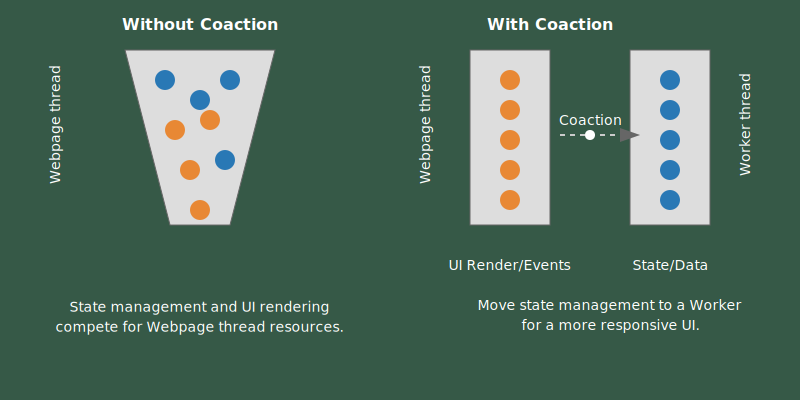
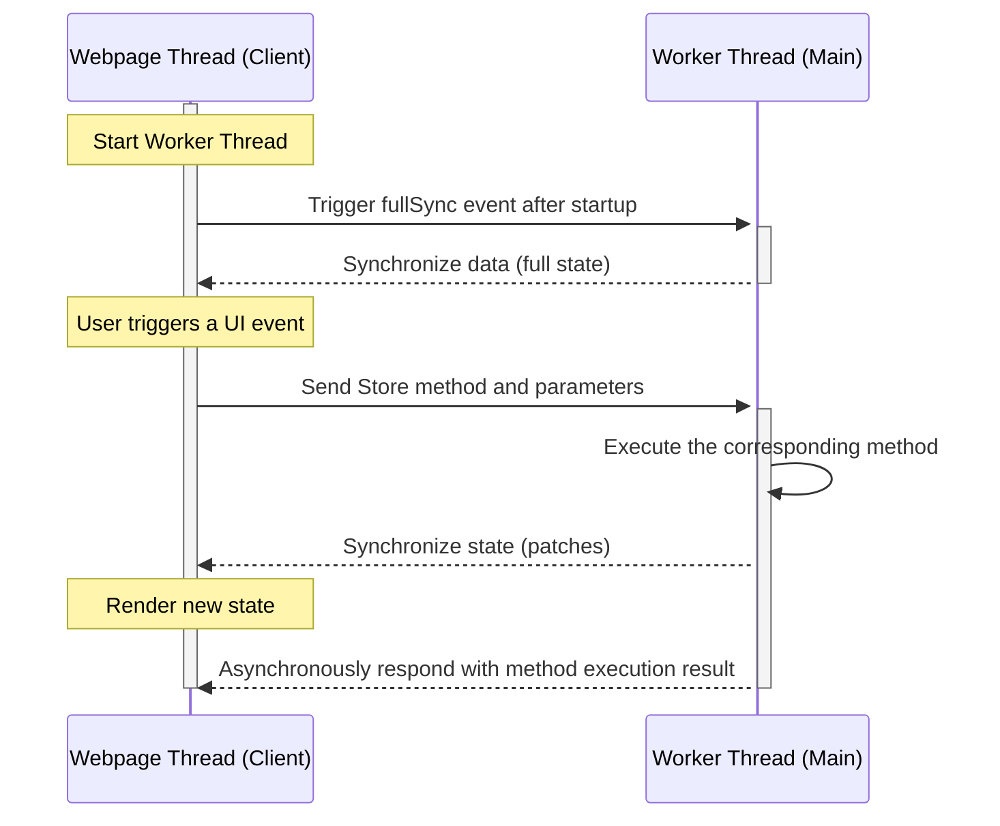
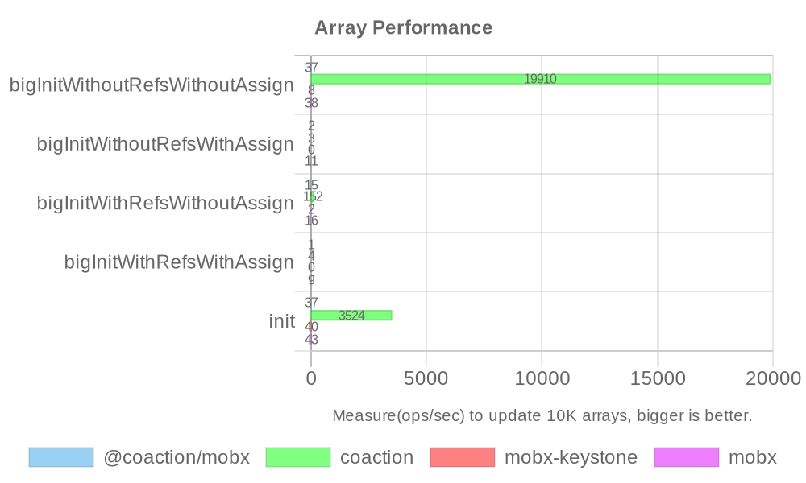

<div align="center">

<a href="https://github.com/unadlib/coaction" target="_blank"></a>

# Coaction

**An efficient and flexible state management library for building<br/>high-performance, multithreading web applications.**

[](https://github.com/unadlib/coaction/actions)
[](https://coveralls.io/github/unadlib/coaction?branch=main)
[](https://www.npmjs.com/package/coaction)
[](./LICENSE)

[Getting Started](#installation) · [Usage](#usage) · [API Reference](#api-reference) · [Examples](#examples) · [FAQ](#faqs)

</div>

<br/>

## Motivation

Modern web applications are becoming increasingly complex, pushing the boundaries of what's possible in the browser. Single-threaded JavaScript often struggles to keep up with the demands of sophisticated UIs, real-time interactions, and data-intensive computations — leading to laggy interfaces and compromised user experiences.

While Web Workers (and SharedWorker) offer a path towards parallelism, they introduce challenges around state management, data synchronization, and maintaining coherent application logic across threads.

<div align="center">
<br/>

<br/><br/>
</div>

**Coaction was created to bridge this gap** — a state management solution that truly embraces the multithreading nature of modern web applications, without sacrificing developer experience.

- **Performance first** — Offload computationally intensive tasks and state management to worker threads, while signal-backed derived state keeps UI reads fast.
- **Scalable architecture** — An intuitive API (inspired by Zustand) with Slices, namespaces, cached getters, and explicit computed dependencies promotes modularity and clean code organization.
- **Flexible synchronization** — Integration with [data-transport](https://github.com/unadlib/data-transport) enables generic transport protocols, supporting various communication patterns including remote synchronization for CRDTs applications.

## Features

- **Multithreading Sync** — Share state between webpage and worker threads. With `data-transport`, avoid the complexities of message passing and serialization.
- **Immutable State with Optional Mutability** — Powered by [Mutative](https://github.com/unadlib/mutative), providing immutable state transitions with opt-in mutable instances for performance.
- **Patch-Based Updates** — Efficient incremental state changes through patch-based synchronization, ideal for CRDTs applications.
- **Signal-Backed Computed** — Accessor getters are cached by default through the built-in `alien-signals` runtime, while `get(deps, selector)` remains available for manual dependencies.
- **Reactive React Selectors** — `@coaction/react` selector subscriptions use signal computed values, so selector-heavy components can subscribe to exactly what they read.
- **Core Signal Exports** — Advanced integrations can import `signal`, `computed`, `effect`, batching helpers, and `defineExternalStoreAdapter` directly from `coaction`.
- **Slices Pattern** — Combine multiple slices into a store with namespace support.
- **Extensible Middleware** — Enhance store behavior with logging, time-travel debugging, persistence, and more.
- **Framework Agnostic** — Works with React, Angular, Vue, Svelte, Solid, and state libraries like Redux, Zustand, and MobX.

## Installation

For React applications:

```bash
npm install coaction @coaction/react
```

For the core library without any framework:

```bash
npm install coaction
```

Coaction 2.0 includes `alien-signals` in the core package. You do not need a
separate `@coaction/alien-signals` install.

## Usage

### Standard Mode Store

```jsx
import { create } from '@coaction/react';

const useStore = create((set) => ({
  count: 0,
  get doubleCount() {
    return this.count * 2;
  },
  increment() {
    set(() => {
      this.count += 1;
    });
  }
}));

const CounterComponent = () => {
  const store = useStore();
  return (
    <div>
      <p>Count: {store.count}</p>
      <p>Double: {store.doubleCount}</p>
      <button onClick={store.increment}>Increment</button>
    </div>
  );
};
```

### Shared Mode Store

**`counter.js`**

```js
export const counter = (set) => ({
  count: 0,
  increment: () => set((state) => state.count++)
});
```

**`worker.js`**

```js
import { create } from '@coaction/react';
import { counter } from './counter';

create(counter);
```

**`App.jsx`**

```jsx
import { create } from '@coaction/react';
import { counter } from './counter';

const worker = new Worker(new URL('./worker.js', import.meta.url), {
  type: 'module'
});
const useStore = create(counter, { worker });

const CounterComponent = () => {
  const store = useStore();
  return (
    <div>
      <p>Count in Worker: {store.count}</p>
      <button onClick={() => store.increment()}>Increment</button>
    </div>
  );
};
```

### Slices Pattern & Derived Data

```jsx
import { create } from '@coaction/react';

const counter = (set, get) => ({
  count: 0,
  // accessor getters are cached automatically
  get tripleCount() {
    return this.count * 3;
  },
  // explicit dependency form for manual dependency control
  doubleCount: get(
    (state) => [state.counter.count],
    (count) => count * 2
  ),
  increment() {
    set(() => {
      // you can use `this` to access the slice state
      this.count += 1;
    });
  }
});

const useStore = create(
  {
    counter
  },
  {
    sliceMode: 'slices'
  }
);
```

Accessor getters are the default derived-state API. Coaction wraps them in
`alien-signals` computed values, so repeated reads are cached until their state
dependencies change. Use `get(deps, selector)` when you want explicit manual
dependencies, for example cross-slice derived data or adapter integration code.

Methods that rely on `this` stay bound when you destructure them from
`getState()`:

```ts
const { increment } = useStore.getState().counter;
increment();
```

## Operating Modes

Coaction operates in two primary modes:

### Standard Mode

The store is managed entirely within the webpage thread. Patch updates are disabled by default for optimal performance.

### Shared Mode

The worker thread serves as the primary source of shared state, utilizing transport for synchronization. Webpage threads act as clients, accessing and manipulating the state asynchronously.

> In shared mode, the library automatically determines the execution context based on transport parameters, handling synchronization seamlessly. You can easily support multiple tabs, multithreading, or multiprocessing.

### Examples

For a [3D scene](./examples/3d-scene/src/windowsManager.ts) shared across several tabs, you can effortlessly handle state management using Coaction:

https://github.com/user-attachments/assets/9eb9f4f8-8d47-433a-8eb2-85f044d6d8fa

<details>
<summary><b>Shared Mode — Sequence Diagram</b></summary>


```mermaid
sequenceDiagram
    participant Client as Webpage Thread (Client)
    participant Main as Worker Thread (Main)

    activate Client
    Note over Client: Start Worker Thread
    activate Main

    Client ->> Main: Trigger fullSync event after startup
    activate Main
    Main -->> Client: Synchronize data (full state)
    deactivate Main

    Note over Client: User triggers a UI event
    Client ->> Main: Send Store method and parameters
    activate Main
    Main ->> Main: Execute the corresponding method
    Main -->> Client: Synchronize state (patches)
    Note over Client: Render new state

    Main -->> Client: Asynchronously respond with method execution result
    deactivate Main
    deactivate Client
```

</details>

## Performance

Benchmark measuring ops/sec to update 50K arrays and 1K objects — higher is better ([source](./scripts/benchmark.ts)).

> Benchmark snapshot from the current `scripts/benchmark.ts` comparison

<div align="center">

</div>

| Library                    | ops/sec | Relative |
| :------------------------- | ------: | -------: |
| **Coaction**               |   5,272 | **1.0x** |
| **Coaction** with Mutative |   4,626 |    0.88x |
| **Zustand**                |   5,233 |    0.99x |
| **Zustand** with Immer     |     253 |    0.05x |

Coaction performs on par with Zustand in standard usage. The key difference emerges with immutable helpers: **Coaction with Mutative is ~18.3x faster than Zustand with Immer** (4,626 vs 253 ops/sec), thanks to [Mutative](https://github.com/unadlib/mutative)'s efficient state update mechanism.

## Coaction vs Zustand

Coaction inherits Zustand's intuitive API design while adding built-in support for features Zustand doesn't offer out of the box:

| Feature                              | Coaction | Zustand |
| :----------------------------------- | :------: | :-----: |
| Built-in multithreading              |    ✅    |   ❌    |
| Signal-backed cached getters         |    ✅    |   ❌    |
| Explicit computed deps via `get()`   |    ✅    |   ❌    |
| Reactive React selector subscription |    ✅    |   ❌    |
| Built-in namespace Slices            |    ✅    |   ❌    |
| Built-in auto selector for state     |    ✅    |   ❌    |
| Built-in multiple stores selector    |    ✅    |   ❌    |
| External store adapter API           |    ✅    |   ❌    |
| Easy middleware implementation       |    ✅    |   ❌    |
| `this` support in getter/action      |    ✅    |   ❌    |

Coaction uses `alien-signals` internally for cached computed getters and
selector reactivity; no separate `@coaction/alien-signals` package is required.

For a deeper side-by-side comparison, see [Coaction vs Zustand](./docs/comparison/zustand.md).
For existing Zustand codebases, see [Migrating from Zustand](./docs/migration/from-zustand.md).

> Some features may have community solutions in Zustand; Coaction provides a more unified and streamlined API suited for modern web application development.

## API Reference

- [Core API index](./docs/api/core/index.md)
- [Core API notes](./docs/api/core/documents/core-api-notes.md)
- [Coaction vs Zustand](./docs/comparison/zustand.md)
- [Migrating from Zustand](./docs/migration/from-zustand.md)
- [Zustand-focused benchmarks](./docs/benchmarking/zustand.md)
- [DevTools roadmap](./docs/roadmap/devtools.md)
- [Architecture overview](./docs/architecture/overview.md)
- [Support matrix](./docs/architecture/support-matrix.md)
- [API evolution](./docs/architecture/api-evolution.md)

Regenerate the reference from source with `pnpm docs:api`.

### Signal Runtime Exports

Coaction 2.0 folds `alien-signals` into the core package. Normal stores do not
need direct signal usage, but integration authors can use the native primitives
without installing an extra package:

```ts
import {
  computed,
  defineExternalStoreAdapter,
  effect,
  effectScope,
  endBatch,
  signal,
  startBatch,
  trigger
} from 'coaction';
```

Use these exports for framework bindings, external store adapters, and advanced
reactivity integrations. For application state, prefer Coaction getters and
`get(deps, selector)`.

### Store Shape Mode (`sliceMode`)

`create()` infers store shape from `createState` by default (`sliceMode: 'auto'`).
For backward compatibility, `auto` still treats a non-empty object whose
enumerable values are all functions as slices. That shape is ambiguous with a
plain store that only contains methods, so development builds warn and you
should set `sliceMode` explicitly.

- **`'single'`** — Treat an object as a single store, even if all values are functions.
- **`'slices'`** — Strict slices mode with validation.

```ts
const singleStore = create(
  {
    ping() {
      return 'pong';
    }
  },
  { sliceMode: 'single' }
);

const slicesStore = create(
  {
    counter: (set) => ({
      count: 0,
      increment() {
        set((draft) => {
          draft.counter.count += 1;
        });
      }
    })
  },
  { sliceMode: 'slices' }
);
```

### Reusable Store

Refactor a general store into a multithreading reusable store — the same source runs on both the webpage and the worker, with isolated references but synchronized state:

**`store.js`**

```diff
+ const worker = globalThis.SharedWorker
+   ? new SharedWorker(new URL('./store.js', import.meta.url), { type: 'module' })
+   : undefined;

export const store = create(
  (set) => ({
    count: 0,
    increment() {
      set((draft) => {
        draft.count += 1;
      });
    }
  }),
+ { worker }
);
```

> **TypeScript note:** In the webpage context, the store type is `AsyncStore` (methods become asynchronous and are proxied to the worker). In the worker context, it's `Store`. See the [reusable store example](examples/vanilla-base/src/store.ts).

## Integration

Coaction is designed to work with a wide range of libraries and frameworks.

### Frameworks

| Framework | Package                                              |
| :-------- | :--------------------------------------------------- |
| React     | `@coaction/react`                                    |
| Vue       | `@coaction/vue`                                      |
| Angular   | `@coaction/ng`                                       |
| Svelte    | `@coaction/svelte`                                   |
| Solid     | `@coaction/solid`                                    |
| Yjs       | [`@coaction/yjs`](./packages/coaction-yjs/README.md) |

### State Management Libraries

| Library       | Package             |
| :------------ | :------------------ |
| MobX          | `@coaction/mobx`    |
| Pinia         | `@coaction/pinia`   |
| Zustand       | `@coaction/zustand` |
| Redux Toolkit | `@coaction/redux`   |
| Jotai         | `@coaction/jotai`   |
| XState        | `@coaction/xstate`  |
| Valtio        | `@coaction/valtio`  |

> **Note:** Slices mode is a core `coaction` feature. Third-party state adapters only support whole-store binding.

Custom state-library integrations should use `defineExternalStoreAdapter()` from
`coaction`. The adapter API bridges an external whole-store runtime while
keeping Coaction subscriptions and signal-backed selectors refreshed.

### Middlewares

| Middleware | Package             |
| :--------- | :------------------ |
| Logger     | `@coaction/logger`  |
| Persist    | `@coaction/persist` |
| Undo/Redo  | `@coaction/history` |

### Yjs Collaboration

For production collaboration setups with `@coaction/yjs`, see:

- [Sync Model](./packages/coaction-yjs/README.md#sync-model)
- [Conflict Semantics](./packages/coaction-yjs/README.md#conflict-semantics)
- [Provider Integration](./packages/coaction-yjs/README.md#provider-integration)
- [Compatibility & Limits](./packages/coaction-yjs/README.md#compatibility-and-limits)
- [Troubleshooting](./packages/coaction-yjs/README.md#troubleshooting)

## FAQs

<details>
<summary><b>Do I need `@coaction/alien-signals`?</b></summary>

No. In Coaction 2.0, `alien-signals` is built into `coaction`. Import native
signal primitives from `coaction` for advanced integrations, and use normal
getter accessors or `get(deps, selector)` for application derived state.

</details>

<details>
<summary><b>Can I use Coaction without multithreading?</b></summary>

Absolutely. Coaction supports single-threaded mode with its full API. In default single-threaded mode, it doesn't use patch updates, ensuring optimal performance.

</details>

<details>
<summary><b>Why is Coaction faster than Zustand with Immer?</b></summary>

Coaction uses [Mutative](https://github.com/unadlib/mutative), which provides a faster state update mechanism. Mutative allows mutable instances for performance optimization, whereas Immer's pure immutable approach incurs more overhead.

</details>

<details>
<summary><b>Why can Coaction integrate with both observable and immutable state libraries?</b></summary>

Coaction is built on Mutative, so it works regardless of whether the state library is immutable or observable. It binds to the existing state object, obtains patches through proxy execution, and applies them to the third-party state library.

</details>

<details>
<summary><b>Does Coaction support CRDTs?</b></summary>

Yes. Coaction achieves remote synchronization through `data-transport`, making it well-suited for CRDTs applications. For Yjs-specific synchronization, see the [`@coaction/yjs` documentation](./packages/coaction-yjs/README.md).

</details>

<details>
<summary><b>Does Coaction support multiple tabs?</b></summary>

Yes. State synchronization between multiple tabs is supported via `data-transport`. Consider using SharedWorker for sharing state across tabs.

</details>

## Contributing

<details>
<summary><b>Maintainer Guide</b></summary>

### Repository Map

- `packages/core` — runtime creation, authority model, patch flow, transport integration, middleware hooks, adapter hooks
- `packages/coaction-*` framework bindings — React, Vue, Angular, Svelte, Solid wrappers around core stores
- `packages/coaction-*` state adapters — whole-store integrations for external runtimes such as Zustand, MobX, Pinia, Redux, Jotai, Valtio, and XState
- `packages/coaction-*` middlewares — logger, persist, history, yjs
- `examples/*` — runnable integration and end-to-end examples
- `docs/architecture/*` — maintainer-oriented runtime, support, and API evolution docs

### Architecture Map

- [Architecture Overview](./docs/architecture/overview.md)
- [Core Runtime](./docs/architecture/core-runtime.md)
- [Threading Model](./docs/architecture/threading-model.md)
- [Support Matrix](./docs/architecture/support-matrix.md)
- [API Evolution](./docs/architecture/api-evolution.md)
- [Adapter Contract](./docs/architecture/adapter-contract.md)

### Supported Integration Matrix

| Surface                | Official contract                                                                                            |
| :--------------------- | :----------------------------------------------------------------------------------------------------------- |
| Native Coaction stores | Local and shared single/slices stores are supported.                                                         |
| Binder-backed adapters | Whole-store only. Shared main/client is currently maintained for MobX, Pinia, and Zustand.                   |
| Middleware authority   | Logger is supported on local/main and limited on clients. Persist and history belong on the authority store. |
| Yjs                    | Local/main store binding is supported. Client mode is unsupported.                                           |

For the package-by-package status and boundary notes, see the
[full support matrix](./docs/architecture/support-matrix.md).

### Testing Pyramid

- Core runtime and type coverage lives in [`packages/core/test`](./packages/core/test).
- Shared binder adapter coverage lives in `packages/*/test/contract.test.ts`.
- Package-specific behavior and branch coverage lives in each package `test/` directory.
- Integration and end-to-end coverage lives in [`packages/coaction-yjs/test/ws.integration.test.ts`](./packages/coaction-yjs/test/ws.integration.test.ts) and [`examples/e2e/test`](./examples/e2e/test).

### Contributing a New Adapter

1. Read the [adapter contract](./docs/architecture/adapter-contract.md) first.
2. Follow the [adapter contribution guide](./docs/contributing/adapter-guide.md).
3. Add the shared binder contract suite when the package is binder-backed.
4. Update the [support matrix](./docs/architecture/support-matrix.md) in the same change as any new guarantee.

</details>

## Credits

- Concept inspired by [Partytown](https://partytown.qwik.dev/)
- API design inspired by [Zustand](https://zustand.docs.pmnd.rs/)
- Technical reference: [React + Redux + Comlink = Off-main-thread](https://dassur.ma/things/react-redux-comlink/)

## License

Coaction is [MIT licensed](./LICENSE).
