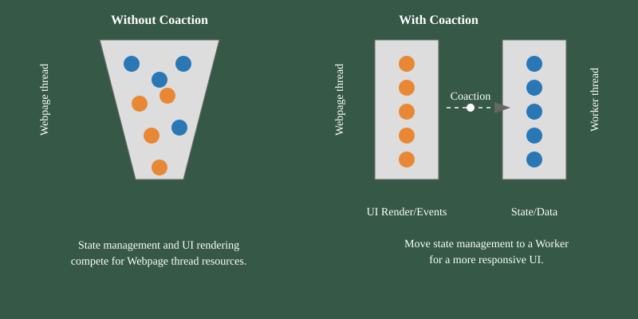

<div align="center">

<a href="https://github.com/coactionjs/coaction" target="_blank"></a>

# Coaction

**A Zustand-style store where render tracking and cached computed state are built in.**<br/>
No selectors. No `useShallow`. No `useMemo`. Just read state and it stays fast.

[](https://github.com/coactionjs/coaction/actions/workflows/nodejs.yml) [](https://www.npmjs.com/package/coaction) [](./LICENSE)

[Website](https://coactionjs.github.io/coaction/en/) · [中文文档](https://coactionjs.github.io/coaction/zh/) · [Quick look](#quick-look) · [Why Coaction](#why-coaction) · [Install](#install) · [Examples](#examples) · [Docs](#docs)

</div>

<br/>

## Quick look

The same counter — but no selector, no `useShallow`, and derived state that caches itself:

```tsx
import { create, observer } from '@coaction/react';

const useCounter = create((set) => ({
  count: 0,
  step: 1,
  // cached automatically — recomputed only when `count` changes
  get doubled() {
    return this.count * 2;
  },
  increment() {
    set(() => {
      this.count += this.step; // mutable write, immutable result
    });
  }
}));

const Counter = observer(() => {
  const store = useCounter(); // tracks only the fields it actually reads

  return (
    <button onClick={store.increment}>
      {store.count} (step {store.step}) → {store.doubled}
    </button>
  );
});
```

<details>
<summary>The same thing in Zustand — selector + shallow equality + manual memo</summary>

```tsx
import { create } from 'zustand';
import { useShallow } from 'zustand/react/shallow';
import { useMemo } from 'react';

const useCounter = create((set) => ({
  count: 0,
  step: 1,
  increment: () => set((s) => ({ count: s.count + s.step }))
}));

function Counter() {
  const { count, step } = useCounter(
    useShallow((s) => ({ count: s.count, step: s.step }))
  );
  const doubled = useMemo(() => count * 2, [count]);

  return (
    <button onClick={() => useCounter.getState().increment()}>
      {count} (step {step}) → {doubled}
    </button>
  );
}
```

</details>

## Why Coaction

You don't need a worker, tabs, or CRDTs to benefit. Coaction folds the pieces you'd normally
assemble by hand into **one cohesive signal graph**, so tracking, computed values, and the
fields they read invalidate together:

- **Automatic render tracking** — `observer()` re-renders a component only for the fields it
  reads. No selectors, no `useShallow`.
- **Cached computed by default** — `get value()` getters memoize until a dependency changes.
  No `useMemo`, no reselect — and **~101x faster** than a Zustand selector that recomputes
  ([numbers](#reading-derived-state)).
- **Mutable writes, immutable results** — just `this.count += 1` inside `set()`. Powered by
  [Mutative](https://github.com/unadlib/mutative) (~18x faster than Zustand + Immer in our benchmark).
- **`this` + this-bound actions** — natural getters and this-bound actions; methods destructured from
  `getState()` stay bound.
- **Escape hatches when you want them** — `useStore(selector)`, `useStore.auto()`, and
  `get(deps, selector)` keep explicit control available.

None of those is individually unique — you can assemble the same experience on Zustand with
`react-tracked` + a computed plugin + auto-selectors + Immer. The difference is that those are
four mechanisms with four mental models and an N×N compatibility matrix across React and Zustand
majors, while Coaction keeps tracking and computed invalidation on **one** `alien-signals` graph,
maintained as a single version contract. That shared substrate — not the feature count — is the
structural argument, and it is made in full, costs included, in
[Why Coaction Without Multithreading](./docs/comparison/single-thread.md).

> **And when you need it, the same store scales up.** Built on a transport + patch foundation,
> the _same_ store source can run in a Worker, SharedWorker, across tabs, or in real-time
> collaboration — multithreading is the ceiling, not the entry fee. Adopt the single-threaded
> DX first, grow into shared mode when the architecture calls for it.



## Is Coaction for you?

Honest answer: **most apps don't need it.** For plain single-tab state, Zustand or Jotai is a
smaller dependency with a bigger ecosystem — "more powerful" is not a reason to pay switching
costs. Coaction earns its dependency line when the _shape of your problem_ is one of these:

- **more derived state than you want to memoize by hand** — cached getters and `this` on one
  signal graph, instead of `react-tracked` + a computed plugin + auto-selectors;
- **one state instance shared across tabs** (SharedWorker authority);
- **heavy compute moved off the main thread** (Web Worker authority).

Know the costs before adopting: roughly 11 KB gzip for `coaction/local` before its dependencies,
and roughly **half the throughput in the maintained 1,000-item update-then-read benchmark** of the
equivalent Zustand scenario. That benchmark does not isolate pure writes, so measure your actual
hot path. If your shared state isn't JSON-shaped or your call sites can't `await` actions, that
matters more — the full boundary list lives in
[When not to use Coaction](https://coactionjs.github.io/coaction/en/docs/guides/when-not-to-use)
([中文](https://coactionjs.github.io/coaction/zh/docs/guides/when-not-to-use)).

## Install

For the core library without any framework:

```bash
npm install coaction
```

Vanilla applications that do not use workers can select the transport-free
entry explicitly:

```ts
import { create } from 'coaction/local';
```

Use `coaction/shared` for a shared-main store or client mirror, and
`coaction/adapter` when authoring an external-state adapter. The compatibility
`coaction` entry still supports both local and shared creation, but
`coaction/local` gives bundlers a hard boundary that excludes the transport,
JSON protocol, epoch, and reconnect runtime.

For React applications:

```bash
npm install coaction @coaction/react
```

Works with React, Vue, Angular, Svelte, and Solid, plus adapters for Redux, Zustand, MobX,
Pinia, Jotai, Valtio, and XState. See [Integration](#integration) for package names and docs.

## Coaction, Zustand, or MobX?

Getters, `this`, and automatic tracking are not new — MobX has shipped them for a decade, and
Pinia gives Vue the same shape. What is uncommon is having them on an **immutable** substrate,
behind a Zustand-style `create()`, across five frameworks.

|                                           | Coaction                       | Zustand                       | MobX                      |
| :---------------------------------------- | :----------------------------- | :---------------------------- | :------------------------ |
| Function-style `create()`, no decorators  | yes                            | yes                           | `makeAutoObservable`      |
| Render tracking without selectors         | `observer()`                   | no — selectors + `useShallow` | `observer()`              |
| `get value()` + `this`                    | yes                            | no                            | yes                       |
| Derived values memoized                   | across independent reads       | no — `useMemo` / reselect     | while observed by default |
| Frozen snapshots, structural sharing      | yes                            | via Immer/Mutative            | no — mutable observables  |
| Patch stream (undo, persist, sync, CRDT)  | built in                       | no                            | `mobx-state-tree`         |
| Frameworks                                | React/Vue/Angular/Svelte/Solid | React-first                   | framework-agnostic        |
| Selected entry size (gzip, deps excluded) | 11.1 KB `coaction/local`       | 0.6 KB vanilla + react        | 16.4 KB                   |

Sizes are selected published entry files measured on this repository's lockfile, not
feature-equivalent React bundles. Coaction's excludes `@coaction/react`, `mutative` (~6.7 KB),
and `alien-signals`; MobX's excludes `mobx-react-lite`; Zustand's includes its vanilla and React
entries but not React itself. They show the order of magnitude of the selected entries, not the
total cost of adopting each stack. Zustand really is much smaller, and that is part of the trade.

Two rows deserve detail, both verified against `mobx@6.15`:

- **"while observed by default."** A MobX `computed` is suspended between independent unobserved
  reads by default, so four plain reads evaluate four times. A reaction keeps it cached, a MobX
  action can reuse it within that transaction, and `keepAlive` opts into retention. Coaction's
  getters cache until a dependency changes without requiring an observer.
- **"mutable observables."** MobX mutates in place, so a reference you captured earlier changes
  underneath you. Coaction's public state is frozen and structurally shared, which is what makes
  the patch stream — and therefore undo/redo, persistence, worker transport, and CRDT — possible
  at all. `mobx-state-tree` buys that back, at the cost of a second type system.

**Stick with Zustand when** you need a small hook store with a few selectors, bundle minimalism is
a top priority, or your team prefers explicit, magic-free subscriptions. **Stick with MobX when**
you want a mature, battle-tested reactive graph and mutable observables are a fit — its ecosystem
and track record are far larger than Coaction's.

The long-form argument, including the honest costs, is in
[Why Coaction Without Multithreading](./docs/comparison/single-thread.md); the feature-by-feature
breakdown is in [Coaction vs Zustand](./docs/comparison/zustand.md).

## Usage

### Your first store

```tsx
import { create, observer } from '@coaction/react';

const useStore = create((set) => ({
  count: 0,
  get doubleCount() {
    return this.count * 2; // cached until `count` changes
  },
  increment() {
    set(() => {
      this.count += 1;
    });
  }
}));

const Counter = observer(() => {
  const store = useStore();
  return (
    <div>
      <p>Count: {store.count}</p>
      <p>Double: {store.doubleCount}</p>
      <button onClick={store.increment}>Increment</button>
    </div>
  );
});
```

Wrap a component in `observer()` and it subscribes to exactly the fields it reads. Plain
`useStore()` outside `observer()` stays a whole-store subscription — use `useStore(selector)`
when you want the classic explicit style.

### Writes happen inside `set()`

Coaction state is immutable by default. Getters and methods read through `this`, but writes
must go through `set()`:

```ts
incrementWrong() {
  this.count += 1; // ❌ throws — outside set()
}

increment() {
  set(() => {
    this.count += 1; // ✅ mutable draft, immutable result
  });
}
```

`set()` is the boundary where Coaction produces the next immutable state and notifies
subscribers. When patches are enabled, it's also where patch pairs are generated — the same
mechanism that powers shared mode later.

### Derived state

Accessor getters are the default derived-state API and cache automatically:

```ts
import { create } from '@coaction/react';

type CartItem = { price: number; quantity: number };

const useCart = create((set) => ({
  items: [] as CartItem[],
  get total() {
    return this.items.reduce((sum, i) => sum + i.price * i.quantity, 0);
  },
  add(item: CartItem) {
    set(() => {
      this.items.push(item);
    });
  }
}));
```

When you want explicit dependencies, use the `get(deps, selector)` form:

```ts
import { create } from '@coaction/react';

type CartItem = { price: number; quantity: number };

const useCart = create((set, get) => ({
  items: [] as CartItem[],
  total: get(
    (state) => [state.items],
    (items) => items.reduce((sum, i) => sum + i.price * i.quantity, 0)
  )
}));
```

### Escape hatches

Automatic tracking is the default, not a cage. The full explicit toolbox stays available:

```tsx
import { createSelector } from '@coaction/react';

// selector across multiple stores; returns a hook
const useCartCredit = createSelector(useCart, useUser);
const selectors = useCart.auto();

function CartSummary() {
  // classic selector (familiar Zustand DX)
  const total = useCart((state) => state.total);

  // cached auto-selector map
  const total2 = useCart(selectors.total);

  // selector across multiple stores
  const remaining = useCartCredit((cart, user) => cart.total + user.credit);

  return <span>{total + total2 + remaining}</span>;
}
```

> The explicit `useStore(selector)` path is _version + recompute + `Object.is`_ — the same
> model Zustand uses. Coaction's fine-grained tracking lives in `observer()` and cached
> getters, so mix the styles freely.

### Slices

Slices are a first-class store shape with namespace support:

```ts
const counter = (set) => ({
  count: 0,
  increment() {
    set(() => {
      this.count += 1; // `this` targets the slice
    });
  },
  incrementByStep() {
    set((draft) => {
      draft.counter.count += draft.settings.step; // root draft for cross-slice
    });
  }
});

const settings = (set) => ({
  step: 1,
  setStep(step) {
    set(() => {
      this.step = step;
    });
  }
});

const useStore = create({ counter, settings }, { sliceMode: 'slices' });
```

Methods destructured from `getState()` stay bound:

```ts
const { increment } = useStore.getState().counter;
increment(); // still works — `this` stays bound to the slice
```

## Scaling up: shared mode

Everything above runs single-threaded. When your architecture calls for it, **the same store
source** can move to a Worker, SharedWorker, or multiple tabs — no rewrite, no manual message
passing.

**`counter.js`**

```js
export const counter = (set) => ({
  count: 0,
  increment() {
    set(() => {
      this.count += 1;
    });
  }
});
```

**`worker.js`**

```js
import { create } from '@coaction/react';
import { counter } from './counter';

create(counter);
```

**`App.jsx`**

```jsx
import { create } from '@coaction/react';
import { counter } from './counter';

const worker = new Worker(new URL('./worker.js', import.meta.url), {
  type: 'module'
});
const useStore = create(counter, { worker });
```

In shared mode the worker owns the state (the _main_ store); webpage threads are _client_
mirrors that read local state and proxy method calls to the main store. Coaction handles
sequencing, patch sync, and reconnect recovery for you.

> **TypeScript note:** in a client context the store type is `AsyncStore` (methods become
> async, proxied to the worker); in the worker context it's a synchronous `Store`.

See the [threading model](./docs/architecture/threading-model.md) for the full authority rules.

### Reusable SharedWorker store

For multi-tab state, the same store module can create a `SharedWorker` on the webpage and run
as the authority store inside the worker:

```js
import { create } from 'coaction/shared';

const worker = globalThis.SharedWorker
  ? new SharedWorker(new URL('./store.js', import.meta.url), { type: 'module' })
  : undefined;

// An explicit `worker: undefined` uses a strict local fallback whose
// `getState()` actions still return promises and obey the shared JSON contract.
export const store = create(
  (set) => ({
    count: 0,
    increment() {
      set(() => {
        this.count += 1;
      });
    }
  }),
  { worker }
);
```

See the [reusable store example](./examples/vanilla-base/src/store.ts) and the
[3D multi-window scene](./examples/3d-scene/README.md) for SharedWorker patterns.

## Performance

Two scenarios matter, and Coaction wins one decisively while paying for it in the other. Both are
reproducible from this repository. Regenerate before quoting them — microbenchmarks move with CPU,
runtime, and package versions. Numbers below: Apple M1 Max, Node 24.16, `zustand@5.0.11`.

### Reading derived state

Run `pnpm benchmark:zustand-positioning` — higher is better:

| Pattern                                   |     ops/sec | Relative |
| :---------------------------------------- | ----------: | -------: |
| **Coaction** cached getter                |  79,491,945 | **1.0x** |
| **Coaction** `get(deps, selector)`        |  49,122,728 |    0.62x |
| Zustand selector that recomputes          |     786,517 |   0.010x |
| Zustand manually maintained `total` field | 111,154,719 |    1.40x |

Against the pattern most codebases actually write — a selector that recomputes derived data —
a cached getter is **~101x faster**. The only faster option is a derived field the application
maintains by hand inside every action, and that is precisely the consistency work Coaction
removes. Deleting that bug surface costs about 28% of read throughput.

### Updating, then reading the derived value

Same script, the update-then-read scenario:

| Pattern                                             |   ops/sec | Relative |
| :-------------------------------------------------- | --------: | -------: |
| **Coaction** mutable update + cached getter         |    43,177 | **1.0x** |
| **Coaction** mutable update + `get(deps, selector)` |    42,193 |    0.98x |
| **Coaction** object replacement + cached getter     |       296 |   0.007x |
| Zustand immutable update + selector recompute       |    88,217 |    2.04x |
| Zustand immutable update + maintained field         | 3,293,247 |   76.27x |

In this 1,000-item update-then-read scenario, Coaction has roughly half the throughput of the
Zustand selector case and is far behind a hand-maintained field. This result includes both the
update and the derived read; it does not establish a universal write-path penalty. Stable repeated
reads are Coaction's strongest path, while update-heavy and mixed workloads should be measured
with representative state and access patterns.

The third row is the cost of a guarantee, not a defect. Whatever you hand to `set({ ... })` is
caller-supplied data, so it is deep-cloned to strip unsafe keys and break aliasing — passing in a
fresh 1,000-element array costs O(payload). The draft path avoids it because Mutative reports
precise patches instead. **Prefer `set((draft) => { ... })` whenever the value you are writing is
large.**

A separate defect on this path was fixed in 3.2.1: copying the store's _current_ root state was
also deep, which made every `set({ ... })` O(total state) even for untouched fields. Replacing one
scalar in a store holding a 10,000-item array went from 1,591 ms to 2 ms per 400 operations. Both
paths are now gated; details are in
[Zustand-focused benchmarks](./docs/benchmarking/zustand.md).

### Bulk update throughput

Run `pnpm benchmark` — updating 50K arrays and 1K objects ([source](./scripts/benchmark.ts)):

| Library                    | ops/sec | Relative |
| :------------------------- | ------: | -------: |
| **Coaction** with Mutative |   4,648 | **1.0x** |
| **Zustand**                |   5,886 |    1.27x |
| **Zustand** with Immer     |     298 |    0.06x |

Coaction's draft path runs ~21% behind Zustand's plain replacement update here, and **~15.6x
ahead of Zustand with Immer**. Coaction's own `set({ ... })` row is left out: at this state size
it is dominated by the payload sanitizer described above, so it measures the guarantee rather
than the update mechanism.

For methodology, thresholds, and how these gates are maintained, see
[Zustand-focused benchmarks](./docs/benchmarking/zustand.md).

## Integration

Coaction works across frameworks, with adapters for popular state libraries and middleware.

| Framework | Package                                                    |
| :-------- | :--------------------------------------------------------- |
| React     | [`@coaction/react`](./packages/coaction-react/README.md)   |
| Vue       | [`@coaction/vue`](./packages/coaction-vue/README.md)       |
| Angular   | [`@coaction/ng`](./packages/coaction-ng/README.md)         |
| Svelte    | [`@coaction/svelte`](./packages/coaction-svelte/README.md) |
| Solid     | [`@coaction/solid`](./packages/coaction-solid/README.md)   |

| State library | Package                                                      |
| :------------ | :----------------------------------------------------------- |
| MobX          | [`@coaction/mobx`](./packages/coaction-mobx/README.md)       |
| Pinia         | [`@coaction/pinia`](./packages/coaction-pinia/README.md)     |
| Zustand       | [`@coaction/zustand`](./packages/coaction-zustand/README.md) |
| Redux Toolkit | [`@coaction/redux`](./packages/coaction-redux/README.md)     |
| Jotai         | [`@coaction/jotai`](./packages/coaction-jotai/README.md)     |
| XState        | [`@coaction/xstate`](./packages/coaction-xstate/README.md)   |
| Valtio        | [`@coaction/valtio`](./packages/coaction-valtio/README.md)   |

| Middleware | Package                                                      |
| :--------- | :----------------------------------------------------------- |
| Logger     | [`@coaction/logger`](./packages/coaction-logger/README.md)   |
| Persist    | [`@coaction/persist`](./packages/coaction-persist/README.md) |
| Undo/Redo  | [`@coaction/history`](./packages/coaction-history/README.md) |

For collaboration, see [`@coaction/yjs`](./packages/coaction-yjs/README.md).

> **Support boundaries are documented, not implied.** Slices mode is core-only; third-party
> state adapters bind the whole store. Not every feature works in every mode — see the
> [support matrix](./docs/architecture/support-matrix.md) for the exact, tested combinations.

Custom integrations should use `defineExternalStoreAdapter()` from `coaction/adapter`. See the
[adapter contract](./docs/architecture/adapter-contract.md) before writing one.

## Examples

- **Cross-tab todos** — the reproducible proof that one SharedWorker authority keeps every tab in
  sync. Run `pnpm exec vite --host 127.0.0.1 --port 4174 --strictPort`, then open
  `http://127.0.0.1:4174/examples/e2e/browser/todos/todos.html` in two tabs. The
  [demo source](./examples/e2e/browser/todos/todos.html) is kept beside its worker and store. Replay
  the same scenario on Chromium, Firefox, and WebKit with
  `pnpm test:e2e:browser -- cross-tab-todos`. No benchmark numbers required — watch it, run it, fork it.
- [3D multi-window scene](./examples/3d-scene/README.md) — SharedWorker state across multiple browser windows ([demo video](https://github.com/user-attachments/assets/9eb9f4f8-8d47-433a-8eb2-85f044d6d8fa)).
- Framework examples — [React](./examples/react-base), [Vue](./examples/vue-base), [Angular](./examples/ng-base), [Svelte](./examples/svelte-base), [Solid](./examples/solid-base).
- Adapter examples — [MobX](./examples/mobx-base), [Pinia](./examples/pinia-base), [Zustand](./examples/zustand-base), and the [adapter gallery](./examples/adapters-base).
- [Middleware examples](./examples/middlewares-base), [vanilla reusable store](./examples/vanilla-base), and [Yjs collaboration](./examples/yjs-collaboration).

## Docs

- [Documentation website](https://coactionjs.github.io/coaction/en/docs/)
- [中文文档](https://coactionjs.github.io/coaction/zh/docs/)
- [Why Coaction Without Multithreading](./docs/comparison/single-thread.md)
- [Coaction vs Zustand](./docs/comparison/zustand.md)
- [Migrating from Zustand](./docs/migration/from-zustand.md)
- [Architecture Overview](./docs/architecture/overview.md)
- [Threading Model](./docs/architecture/threading-model.md)
- [Support Matrix](./docs/architecture/support-matrix.md)
- [Core API Reference](./docs/api/core/index.md)

## FAQs

<details>
<summary><b>Can I use Coaction without multithreading?</b></summary>

Yes — that's the recommended starting point. In single-threaded mode you get the full API, and
patch updates stay off for optimal performance.

</details>

<details>
<summary><b>Do I need <code>@coaction/alien-signals</code>?</b></summary>

No. `alien-signals` is built into `coaction`. Use normal getters or `get(deps, selector)` for
app state; import signal primitives from `coaction` only for advanced integrations.

</details>

<details>
<summary><b>Why is Coaction faster than Zustand with Immer?</b></summary>

Coaction uses [Mutative](https://github.com/unadlib/mutative), which allows mutable instances
for performance. Immer's copy-on-write path is significantly slower.

</details>

<details>
<summary><b>Does Coaction support CRDTs / multiple tabs?</b></summary>

Yes. Remote sync runs on `data-transport`, so it suits CRDT apps and multi-tab state (use
SharedWorker to share across tabs). For Yjs specifically, see [`@coaction/yjs`](./packages/coaction-yjs/README.md).

</details>

## Contributing

Start with [CONTRIBUTING.md](./CONTRIBUTING.md). Security reports follow [SECURITY.md](./SECURITY.md),
and participation is covered by [CODE_OF_CONDUCT.md](./CODE_OF_CONDUCT.md).

Pull request CI is maintainer-gated: a maintainer adds the `run-ci` label when a PR is ready.
Once the label is present, later pushes to the same PR keep running CI.

<details>
<summary><b>Maintainer Guide</b></summary>

### Repository Map

- `packages/core` — runtime creation, authority model, patch flow, transport integration, middleware hooks, adapter hooks
- `packages/coaction-*` **framework bindings** — React, Vue, Angular, Svelte, Solid wrappers around core stores
- `packages/coaction-*` **state adapters** — whole-store integrations for external runtimes (Zustand, MobX, Pinia, Redux, Jotai, Valtio, XState)
- `packages/coaction-*` **middlewares** — logger, persist, history, yjs
- `examples/*` — runnable integration and end-to-end examples
- `docs/architecture/*` — maintainer-oriented runtime, support, and API-evolution docs

### Architecture Map

- [Architecture Overview](./docs/architecture/overview.md)
- [Core Runtime](./docs/architecture/core-runtime.md)
- [Threading Model](./docs/architecture/threading-model.md)
- [Support Matrix](./docs/architecture/support-matrix.md)
- [API Evolution](./docs/architecture/api-evolution.md)
- [Adapter Contract](./docs/architecture/adapter-contract.md)
- [DevTools Roadmap](./docs/roadmap/devtools.md)

### Supported Integration Matrix

| Surface                | Official contract                                                                                            |
| :--------------------- | :----------------------------------------------------------------------------------------------------------- |
| Native Coaction stores | Local and shared single/slices stores are supported.                                                         |
| Binder-backed adapters | Whole-store only. Shared main/client is currently maintained for MobX, Pinia, and Zustand.                   |
| Middleware authority   | Logger is supported on local/main and limited on clients. Persist and history belong on the authority store. |
| Yjs                    | Local/main store binding is supported. Client mode is unsupported.                                           |

For the package-by-package status and boundary notes, see the [full support matrix](./docs/architecture/support-matrix.md).

### Testing Pyramid

- Core runtime and type coverage — [`packages/core/test`](./packages/core/test)
- Shared binder adapter coverage — `packages/*/test/contract.test.ts`
- Package-specific behavior and branch coverage — each package's `test/` directory
- Integration and end-to-end coverage — [`packages/coaction-yjs/test/ws.integration.test.ts`](./packages/coaction-yjs/test/ws.integration.test.ts) and [`examples/e2e/test`](./examples/e2e/test)

Run the full gate locally with `pnpm check` (lint + typecheck + build + package quality/size + tests + e2e).

### Contributing a New Adapter

1. Read the [adapter contract](./docs/architecture/adapter-contract.md) first.
2. Follow the [adapter contribution guide](./docs/contributing/adapter-guide.md).
3. Add the shared binder contract suite when the package is binder-backed.
4. Update the [support matrix](./docs/architecture/support-matrix.md) in the same change as any new guarantee.

### Release Flow

Releases run through [Changesets](https://github.com/changesets/changesets):

1. `pnpm changeset` — describe the change and pick version bumps.
2. `pnpm changeset:check` — validate pending changesets. Set
   `ALLOW_MAJOR_RELEASE=1` when intentionally preparing a major release.
3. `ALLOW_MAJOR_RELEASE=1 pnpm run version` — validate and apply a major bump
   across the workspace; omit the environment variable for patch/minor bumps.
4. Run `pnpm check`, commit only the generated version/changelog changes, and
   push the release commit.
5. Publish a GitHub Release whose `vX.Y.Z` tag points at that commit. The
   [npm publish workflow](./.github/workflows/npm-publish.yml) checks the tagged
   source and publishes every official package with npm Trusted Publishing and
   provenance.

All official packages are versioned together and released as a single line.

</details>

## Credits

- Concept inspired by [Partytown](https://partytown.qwik.dev/)
- API design inspired by [Zustand](https://zustand.docs.pmnd.rs/)
- Technical reference: [React + Redux + Comlink = Off-main-thread](https://dassur.ma/things/react-redux-comlink/)

## License

Coaction is [MIT licensed](./LICENSE).
