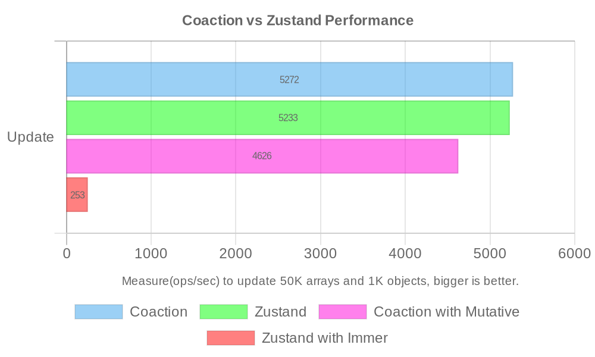

# Coaction

<a href="https://github.com/unadlib/coaction" target="_blank"></a>


[](https://coveralls.io/github/unadlib/coaction?branch=main)
[](https://www.npmjs.com/package/coaction)
[](https://npmtrends.com/coaction)


An efficient and flexible state management library for building high-performance, multithreading web applications.

## Motivation

Modern web applications are becoming increasingly complex, pushing the boundaries of what's possible in the browser. Single-threaded JavaScript, while powerful, often struggles to keep up with the demands of sophisticated UIs, real-time interactions, and data-intensive computations. This bottleneck leads to performance issues, laggy or unresponsive interfaces, limitations in request connections, and ultimately, a compromised user experience.

While Web Workers (or SharedWorker) offer a path towards parallelism and improved performance, they introduce a new set of challenges. Managing state across threads, synchronizing data efficiently, and maintaining coherent application logic can quickly become a daunting task. Existing state management solutions often fall short in addressing these specific needs, either by being too tightly coupled to the worker thread or by introducing complex abstractions that hinder developer productivity.


**`Coaction` was created out of the need for a state management solution that truly embraces the multithreading nature of modern web applications.** It recognizes that performance and developer experience shouldn't be mutually exclusive. By leveraging the power of Web Workers and Shared Workers, `Coaction` allows developers to offload computationally intensive tasks and state management logic from the worker thread, resulting in a more responsive and fluid user interface.

**More than just performance, `Coaction` is about enabling a more scalable and maintainable architecture for complex applications.** The library's intuitive API, inspired by Zustand, ensures a smooth learning curve and a productive development workflow. Its support for Slices, namespaces, and computed properties promotes modularity and code organization, making it easier to manage large and evolving codebases.

**`Coaction`'s integration with `data-transport` unlocks a new level of flexibility in state synchronization.** By supporting generic transport protocols, it opens up possibilities for various communication patterns and architectures, catering to the unique needs of different applications.

**In essence, `Coaction` empowers developers to build the next generation of web applications without sacrificing performance, developer experience, or architectural integrity.** It bridges the gap between the increasing complexity of web applications and the need for efficient, maintainable, and performant state management across threads. It's a tool designed for developers who strive to create exceptional user experiences in a world where parallelism and responsiveness are no longer optional, but essential. It also supports remote synchronization, making it suitable for building any CRDTs application as well.

## Concepts and Features

`Coaction` aims to provide a secure and efficient solution for sharing and synchronizing state in multithreading environments (such as Web Workers, Shared Workers, or even across processes and devices) in web applications.

Key features include:

- **Multithreading Sync**: Supports sharing state between webpage thread and the worker thread. With `data-transport` for generic communication, developers can avoid the complexities of message passing and serialization logic.
- **Immutable State with Optional Mutability**: Powered by the [Mutative](https://github.com/unadlib/mutative) library, the core provides an immutable state transition process while allowing performance optimization with mutable instances when needed.
- **Patch-Based Updates**: Enables efficient incremental state changes through patch-based synchronization, simplifying its use in CRDTs applications.
- **Built-in Computed**: Supports derived properties based on state dependencies, making it easier to manage and retrieve computed data from core states.
- **Slices Pattern**: Easily combine multiple slices into a store with namespace.
- **Extensible Middleware**: Allows for middleware to enhance the store's behavior, such as logging, time-travel debugging, or integration with third-party tools.
- **Integration with 3rd-Party Libraries**: Supports popular frameworks like React, Angular, Vue, Svelte, and Solid, as well as state management libraries such as Redux, Zustand, and MobX.

## Operating Modes and Fundamentals

This library operates in two primary modes:

- Standard Mode
  - In a standard webpage environment, the store is managed entirely within the webpage thread. Patch updates are disabled by default to ensure optimal performance in standard mode.
- Shared Mode
  - The worker thread serves as the primary source of the shared state, utilizing transport for synchronization.
  - Webpage thread act as clients, accessing and manipulating the state asynchronously through a store.

In shared mode, the library automatically determines the execution context based on the transport parameters, handling the synchronization thread seamlessly.

You can easily use `Coaction` in your application to support multiple tabs, multithreading, or multiprocessing.

For example, for a [3D scene](./examples/3d-scene/src/windowsManager.ts) shared across several tabs, you can effortlessly handle their state management using `Coaction`.

https://github.com/user-attachments/assets/9eb9f4f8-8d47-433a-8eb2-85f044d6d8fa

### Shared Mode - Sequence Diagram


## Performance

Measure(ops/sec) to update 50K arrays and 1K objects, bigger is better([view source](./scripts/benchmark.ts)). [Coaction v0.1.5 vs Zustand v5.0.2]



```
Coaction x 5,272 ops/sec ±3.08% (63 runs sampled)
Coaction with Mutative x 4,626 ops/sec ±2.26% (83 runs sampled)
Zustand x 5,233 ops/sec ±2.68% (79 runs sampled)
Zustand with Immer x 253 ops/sec ±0.26% (93 runs sampled)

The fastest method is Coaction,Zustand
```

According to the provided performance data, Coaction's performance is comparable to Zustand's performance. However, Coaction with Mutative demonstrates a significant performance advantage compared to Zustand with Immer.

While standard Coaction achieves approximately 5,272 (ops/sec) and standard Zustand reaches around 5,233 (ops/sec), the most striking difference is observed with Zustand with Immer, which drastically drops to a mere 253 (ops/sec). Furthermore, Coaction with Mutative achieves around 4,626 (ops/sec). This means Coaction with Mutative is approximately 18.3X faster than Zustand with Immer (4626 / 253 ≈ 18.3). The data clearly indicates that Coaction offers superior performance characteristics compared to Zustand, and this advantage is especially pronounced when contrasted with Zustand's Immer implementation.

> We will also provide more complete benchmarking.

## Difference between Coaction and Zustand

Coaction's design philosophy is to provide a necessary and sufficiently simple API, making it easy for developers to use. Therefore, Coaction inherits the advantages of Zustand's API design and includes built-in support for features that Zustand does not offer.

|                                   | Coaction | Zustand |
| --------------------------------- | -------- | ------- |
| Built-in multithreading           | ✅       | ❌      |
| Support getter accessor           | ✅       | ❌      |
| Built-in computed properties      | ✅       | ❌      |
| Built-in namespace Slice          | ✅       | ❌      |
| Built-in auto selector for state  | ✅       | ❌      |
| Built-in multiple stores selector | ✅       | ❌      |
| Easy to implement middleware      | ✅       | ❌      |
| Support `this` in getter/action   | ✅       | ❌      |

> Some of these features may already have corresponding solutions in the Zustand community; however, Coaction opts for a more unified and streamlined API, better suited to the development needs of modern web applications.

## Installation

You can install `@coaction/react` for React application via npm, yarn, or pnpm.

```bash
npm install coaction @coaction/react
```

If you want to use the core library without any framework, you can install `coaction` via npm, yarn, or pnpm.

```bash
npm install coaction
```

## Usage

### Standard Mode Store

```jsx
import { create } from '@coaction/react';

const useStore = create((set) => ({
  count: 0,
  increment: () => set((state) => state.count++)
}));

const CounterComponent = () => {
  const store = useStore();
  return (
    <div>
      <p>Count: {store.count}</p>
      <button onClick={store.increment}>Increment</button>
    </div>
  );
};
```

### Shared Mode Store

`counter.js`:

```js
export const counter = (set) => ({
  count: 0,
  increment: () => set((state) => state.count++)
});
```

`worker.js`:

```js
import { create } from '@coaction/react';
import { counter } from './counter';

create(counter);
```

```jsx
import { create } from '@coaction/react';
import { counter } from './counter';

const worker = new Worker(new URL('./worker.js', import.meta.url), {
  type: 'module'
});
const useStore = create(counter, { worker });

const CounterComponent = () => {
  const store = useStore();
  return (
    <div>
      <p>Count in Worker: {store.count}</p>
      <button onClick={() => store.increment()}>Increment</button>
    </div>
  );
};
```

### Slices Pattern And Derived Data

```jsx
import { create } from '@coaction/react';

const counter = (set, get) => ({
  count: 0,
  // derived data without cache
  get tripleCount() {
    return this.count * 3;
  },
  // derived data with cache
  doubleCount: get(
    (state) => [state.counter.count],
    (count) => count * 2
  ),
  increment() {
    set(() => {
      // you can use `this` to access the slice state
      this.count += 1;
    });
  }
});

const useStore = create({
  counter
});
```

### Store Shape Mode (`sliceMode`)

`create()` infers store shape from `createState` by default (`sliceMode: 'auto'`).

- Use `sliceMode: 'single'` when you want an object to be treated as a single store, even if all values are functions.
- Use `sliceMode: 'slices'` when you want strict slices mode with validation.

```ts
const singleStore = create(
  {
    ping() {
      return 'pong';
    }
  },
  { sliceMode: 'single' }
);

const slicesStore = create(
  {
    counter: (set) => ({
      count: 0,
      increment() {
        set((draft) => {
          draft.counter.count += 1;
        });
      }
    })
  },
  { sliceMode: 'slices' }
);
```

### Reusable Store

You can refactor a general store into a multi-thread reusable store like this. This means you can use this store source code on a webpage and also on a worker. The key difference is that the references to these two stores are isolated, but their state is synchronized.

`store.js`:

```diff
+ const worker = globalThis.SharedWorker ? new SharedWorker(new URL('./store.js', import.meta.url), { type: 'module' }) : undefined;

export const store = create(
  (set) => ({
    count: 0,
    increment() {
      set((draft) => {
        draft.count += 1;
      });
    }
  }),
+ { worker }
 );
```

> If you use TypeScript, then you should be aware of the difference between the two different store types. In the webpage context, it's AsyncStore (because its methods will become asynchronous, and these methods will be proxied to the worker for execution). In the worker context, it's Store. You can see [the reusable store example](examples/vanilla-base/src/store.ts).

## Integration

Coaction is designed to be compatible with a wide range of libraries and frameworks.

### Supported Libraries and Frameworks

|         | Package          | Status |
| ------- | ---------------- | ------ |
| React   | @coaction/react  | ✅     |
| Vue     | @coaction/vue    | 🔶     |
| Angular | @coaction/ng     |        |
| Svelte  | @coaction/svelte |        |
| Solid   | @coaction/solid  |        |
| Yjs     | @coaction/yjs    |        |

### State Management Libraries

|               | Package           | Status |
| ------------- | ----------------- | ------ |
| MobX          | @coaction/mobx    | ✅     |
| Pinia         | @coaction/pinia   | ✅     |
| Zustand       | @coaction/zustand | ✅     |
| Redux Toolkit | @coaction/redux   |        |
| Jotai         | @coaction/jotai   |        |
| XState        | @coaction/xstate  |        |
| Valtio        | @coaction/valtio  |        |

> Note: `Slices` mode is a core `coaction` feature. Third-party state adapters (`@coaction/mobx`, `@coaction/pinia`, `@coaction/zustand`) only support whole-store binding.

## Middlewares

|           | Package           | Status |
| --------- | ----------------- | ------ |
| Logger    | @coaction/logger  | ✅     |
| Persist   | @coaction/persist | 🔶     |
| Undo/Redo | @coaction/history | 🔶     |

## FAQs

- Can I use Coaction without using multithreading?

Absolutely, Coaction also supports single-threaded mode. Its API is designed to be usable in both multithreaded and single-threaded environments. It's powerful, simple, and offers high performance. In its default single-threaded mode, it doesn't use patch updates to ensure optimal performance.

- Why is Coaction faster than Zustand with Immer?

Coaction utilizes the Mutative library, which offers a faster state update mechanism. The Mutative library allows for the use of mutable instances for performance optimization when needed, whereas Zustand uses the Immer library, which is an immutable library and can potentially lead to performance slowdowns.

- Why can Coaction integrate with both observable and immutable state libraries?

Coaction is based on the Mutative library, so it can be used regardless of whether the state is immutable or not. No matter the nature of the state library, Coaction can integrate with it effectively. It can first bind to the existing state object and then, through proxy execution, obtain patches for modifying the state. Finally, it applies these patches to the third-party state library to update the state.

- Does Coaction support CRDTs?

Yes, Coaction supports CRDTs. It can achieve remote synchronization through the `data-transport` library, making Coaction well-suited for building any CRDTs application.

- Does Coaction support multiple tabs?

Yes, Coaction supports multiple tabs. It can achieve state synchronization between multiple tabs through the `data-transport` library. You might consider using SharedWorker for support, which allows sharing state between multiple tabs.

## Credits

- Coaction's concept is inspired by [Partytown](https://partytown.qwik.dev/).
- Coaction's API is inspired by [Zustand](https://zustand.docs.pmnd.rs/).
- Inspiring Technical Article
  - [React + Redux + Comlink = Off-main-thread](https://dassur.ma/things/react-redux-comlink/)
  - [Is postMessage slow?](https://dassur.ma/things/is-postmessage-slow/)

## License

`Coaction` is [MIT licensed](./LICENSE).
