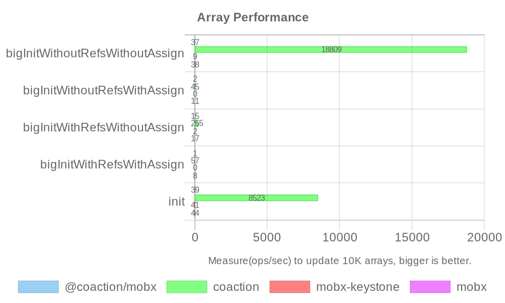

# @coaction/mobx


[](https://www.npmjs.com/package/@coaction/mobx)


A Coaction integration tool for MobX

## Installation

You can install it via npm, yarn or pnpm.

```sh
npm install coaction @coaction/mobx
```

## Usage

```js
import { create } from 'coaction';
import { bindMobx } from '@coaction/mobx';
import { makeAutoObservable } from 'mobx';

const useStore = create(() =>
  makeAutoObservable(
    bindMobx({
      count: 0,
      get double() {
        return this.count * 2;
      },
      increment() {
        this.count += 1;
      }
    })
  )
);
```

### setState()

- It is recommended to update state through store methods, instead of directly updating the state.
- Any direct mutations to the state outside of methods should be wrapped in setState()

```js
// ❌ it will not be triggered state update
store.getState().counter.count += 1;

// ✅ it will be triggered state update
store.setState(() => {
  store.getState().counter.count += 1;
});
```

## Performance



Measure(ops/sec) to update 10K arrays, bigger is better([view source](https://github.com/unadlib/mutative/blob/main/test/performance/benchmark.ts)).

| Library        | Test Case                       | Ops/sec |
| -------------- | ------------------------------- | ------- |
| @coaction/mobx | bigInitWithoutRefsWithoutAssign | 37.44   |
| mobx           | bigInitWithoutRefsWithoutAssign | 37.67   |
| coaction       | bigInitWithoutRefsWithoutAssign | 18,809  |
| mobx-keystone  | bigInitWithoutRefsWithoutAssign | 8.53    |
| @coaction/mobx | bigInitWithoutRefsWithAssign    | 1.54    |
| mobx           | bigInitWithoutRefsWithAssign    | 10.78   |
| coaction       | bigInitWithoutRefsWithAssign    | 45.20   |
| mobx-keystone  | bigInitWithoutRefsWithAssign    | 0.13    |
| @coaction/mobx | bigInitWithRefsWithoutAssign    | 14.99   |
| mobx           | bigInitWithRefsWithoutAssign    | 16.68   |
| coaction       | bigInitWithRefsWithoutAssign    | 255     |
| mobx-keystone  | bigInitWithRefsWithoutAssign    | 2.35    |
| @coaction/mobx | bigInitWithRefsWithAssign       | 1.01    |
| mobx           | bigInitWithRefsWithAssign       | 7.71    |
| coaction       | bigInitWithRefsWithAssign       | 57.22   |
| mobx-keystone  | bigInitWithRefsWithAssign       | 0.11    |
| @coaction/mobx | init                            | 38.57   |
| mobx           | init                            | 43.88   |
| coaction       | init                            | 8,523   |
| mobx-keystone  | init                            | 41.19   |

This table benchmarks various state management libraries on large initialization tasks. Coaction stands out dramatically, performing at least hundreds of times faster in certain scenarios. For example, in the “bigInitWithoutRefsWithoutAssign” test, Coaction achieves 18,809 ops/sec compared to MobX’s 37.67 ops/sec—over 500 times faster. Similarly, in the “init” test, Coaction reaches 8,523 ops/sec versus MobX’s 43.88 ops/sec—an increase of roughly 200 times. Additionally, Coaction consistently outperforms other libraries across various initialization scenarios, showcasing its exceptional efficiency in handling large-scale data initialization. These results highlight Coaction’s superior performance and make it a highly effective solution for managing complex state in modern front-end applications.

> We will also provide more complete benchmarking.

## Documentation

You can find the documentation [here](https://github.com/unadlib/coaction).
